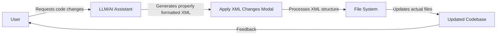

# XML Format Guide for Apply XML Changes

This document explains how the "Apply XML Changes" feature works and how the XML format is structured for modifying code files.

## Workflow Overview

The "Apply XML Changes" feature allows for automated code modifications through a structured XML format generated by an LLM (Large Language Model) like Claude.



## Understanding the Workflow

1. **User Request**: The user describes the code changes they want to make
2. **LLM Processing**: The AI assistant (LLM) processes the request and formulates the needed changes
3. **XML Generation**: The LLM outputs correctly formatted XML that describes all necessary file changes
4. **XML Application**: The "Apply XML Changes" feature parses this XML and applies the changes to the actual files
5. **Feedback Loop**: The user sees the updated code and can request further modifications

## Common XML Parsing Issues

When the LLM generates React/JSX code through the XML format, there are several common issues that can cause parsing errors:

1. **Template Literals**: Backticks (\`) and `${}` interpolation syntax can confuse the XML parser 
2. **JSX Attributes**: Attributes like `size={16}` in JSX components can be misinterpreted
3. **String Quoting**: Inconsistent or nested quotes can break the XML structure
4. **CSS Class Names**: Multi-class names with special characters need special handling

## Correct XML Format Example

Here's an example of correctly formatting a React component with JSX in the XML format:

```xml
<changed_files>
  <file>
    <file_summary>Update CopyButton component with animations and visual feedback</file_summary>
    <file_operation>UPDATE</file_operation>
    <file_path>src/components/CopyButton.tsx</file_path>
    <file_code>
import React, { useState } from "react";
import { Copy, Check } from "lucide-react";

interface CopyButtonProps {
  text: string;
  className?: string;
  children?: JSX.Element | string;
}

const CopyButton = ({ text, className = "", children }: CopyButtonProps) => {
  const [copied, setCopied] = useState(false);

  const handleCopy = async () => {
    try {
      await navigator.clipboard.writeText(text);
      setCopied(true);

      // Reset the copied state after 2 seconds
      setTimeout(() => {
        setCopied(false);
      }, 2000);
    } catch (err) {
      console.error("Failed to copy:", err);
    }
  };

  return (
    <button
      type="button"
      className={`
        relative 
        bg-blue-500 
        hover:bg-blue-600 
        text-white 
        px-3 
        py-2 
        rounded-md
        shadow-md
        hover:shadow-lg
        transform 
        hover:scale-105
        active:scale-95
        transition-all 
        duration-200 
        ease-in-out
        focus:outline-none 
        focus:ring-2 
        focus:ring-blue-300
        focus:ring-opacity-50
        ${copied ? 'bg-green-500 hover:bg-green-600' : ''}
        ${className}
      `}
      onClick={handleCopy}
      title={copied ? "Copied!" : "Copy to clipboard"}
    >
      <span className="flex items-center justify-center gap-2">
        <span className={`transition-transform duration-200 ${copied ? 'scale-110' : ''}`}>
          {copied ? <Check size={16} /> : <Copy size={16} />}
        </span>
        {children}
      </span>
      
      {/* Ripple effect on click */}
      {copied && (
        <span 
          className="absolute inset-0 rounded-md animate-ping opacity-30 bg-white"
          style={{ animationDuration: '0.75s' }}
        />
      )}
    </button>
  );
};

export default CopyButton;
    </file_code>
  </file>
</changed_files>
```

## Troubleshooting Tips for LLM XML Generation

For LLMs generating XML that may encounter parsing errors:

1. **CDATA Sections**: For complex JSX or template literals, the LLM should use CDATA sections:
   ```xml
   <file_code><![CDATA[
     // Your complex React code here
   ]]></file_code>
   ```

2. **Escaping Special Characters**: Special XML characters should be replaced with their entities:
   - `&` → `&amp;`
   - `<` → `&lt;`
   - `>` → `&gt;`
   - `"` → `&quot;`
   - `'` → `&apos;`

3. **Balanced Tags**: All XML tags must be properly balanced and nested

4. **XML Validation**: The generated XML structure should follow the expected schema

## XML Schema Specification

The XML structure must follow this format:
- `<changed_files>` - Root element
  - `<file>` - Each file to be modified
    - `<file_summary>` - Brief description of changes
    - `<file_operation>` - Operation type (CREATE, UPDATE, DELETE)
    - `<file_path>` - Path to the file
    - `<file_code>` - Complete code for the file

By following these guidelines, the LLM can generate XML that will be correctly processed by the "Apply XML Changes" feature. 